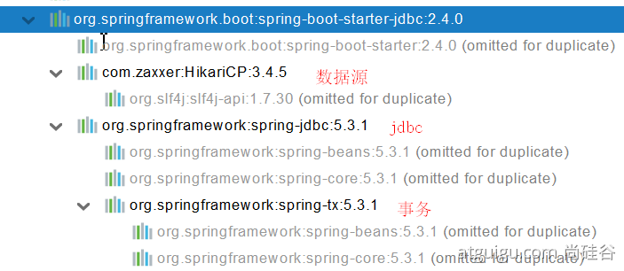

title:: jdbc/Druid

- #[[jdbc/Druid]] #springboot #数据源 #Druid
  title:: jdbc/Druid
-
- ### 导入JDBC场景
- ```xml
   <dependency>
       <groupId>org.springframework.boot</groupId>
       <artifactId>spring-boot-starter-data-jdbc</artifactId>
   </dependency>
  ```
	- 
	- 1. 其中默认配置得数据源是 HikariDataSource
- ### 导入数据库驱动
- ```
   默认版本：<mysql.version>8.0.22</mysql.version>
   <dependency>
       <groupId>mysql</groupId>
       <artifactId>mysql-connector-java</artifactId>
  	 <version>5.1.49</version>
   </dependency>
   // 方式2
   <properties>
      <java.version>1.8</java.version>
      <mysql.version>5.1.49</mysql.version>
  </properties>
  ```
- ### 分析自动配置
- 1. 自动配置的类
	- DataSourceAutoConfiguration
		- 修改数据源配置：spring.datasource
		- 数据库连接池的配置，是自己容器中没有DataSource才自动配置的
		- 底层配置好的连接池是：HikariDataSource
- ```java
      @Configuration(
          proxyBeanMethods = false
      )
      @Conditional({DataSourceAutoConfiguration.PooledDataSourceCondition.class})
      @ConditionalOnMissingBean({DataSource.class, XADataSource.class})
      @Import({Hikari.class, Tomcat.class, Dbcp2.class, OracleUcp.class, Generic.class, DataSourceJmxConfiguration.class})
      protected static class PooledDataSourceConfiguration {
          protected PooledDataSourceConfiguration() {
          }
      }
  ```
	- DataSourceTransactionManagerAutoConfiguration： 事务管理器的自动配置
	- JdbcTemplateAutoConfiguration： jdbcTemplate自动配置，可以对数据库进行操作
		- 可以修改@ConfigurationProperties(prefix = "spring.jdbc") 来修改jdbctemplate默认配置
		- @Bean@Primary    JdbcTemplate；容器中有这个组件
		- JndiDataSourceAutoConfiguration： jndi的自动配置
- ### 修改配置项
	- ```yml
	  spring:
	    datasource:
	      url: jdbc:mysql://localhost:3306/test?useUnicode=true&characterEncoding=UTF-8&useJDBCCompliantTimezoneShift=true&useLegacyDatetimeCode=false&serverTimezone=UTC
	      username: root
	      password: 123456
	      driver-class-name: com.mysql.cj.jdbc.Driver
	  ```
	- 测试
	- ```java
	  @SpringBootTest
	  class Springboot3ApplicationTests {
	      @Autowired
	      JdbcTemplate jdbcTemplate;
	      @Test
	      void contextLoads() {
	          List<Map<String, Object>> maps = jdbcTemplate.queryForList("select * from user");
	          System.out.println(maps);
	      }
	  }
	  ```
-
- ## 使用Druid
- [Druid官方github地址 ](https://github.com/alibaba/druid)
- ### 引入依赖
- ```
          <dependency>
              <groupId>com.alibaba</groupId>
              <artifactId>druid</artifactId>
              <version>1.2.8</version>
          </dependency>
  ```
- ### 配置数据源
- ```
  // 原配置方式
  <bean id="dataSource" class="com.alibaba.druid.pool.DruidDataSource"
  		destroy-method="close">
  		<property name="url" value="${jdbc.url}" />
  		<property name="username" value="${jdbc.username}" />
  		<property name="password" value="${jdbc.password}" />
  		<property name="maxActive" value="20" />
  		<property name="initialSize" value="1" />
  		<property name="maxWait" value="60000" />
  		<property name="minIdle" value="1" />
  		<property name="timeBetweenEvictionRunsMillis" value="60000" />
  		<property name="minEvictableIdleTimeMillis" value="300000" />
  		<property name="testWhileIdle" value="true" />
  		<property name="testOnBorrow" value="false" />
  		<property name="testOnReturn" value="false" />
  		<property name="poolPreparedStatements" value="true" />
  		<property name="maxOpenPreparedStatements" value="20" />
  ```
	- 创建配置类进行设置数据源
	- ```
	  ## Myconfig.java
	  @Configuration
	  public class MyConfig {
	  
	      @Bean
	      @ConfigurationProperties("spring.datasource")
	      public DataSource getdatasource(){
	          DruidDataSource druidDataSource = new DruidDataSource();
	          return druidDataSource;
	      }
	  }
	  
	  ## application.yml
	  spring:
	    datasource:
	      url: jdbc:mysql://localhost:3306/test?useUnicode=true&characterEncoding=UTF-8&useJDBCCompliantTimezoneShift=true&useLegacyDatetimeCode=false&serverTimezone=UTC
	      username: root
	      password: 123456
	      driver-class-name: com.mysql.cj.jdbc.Driver
	  
	  ```
- ### 引入外部组件方式配置Druid
	- 数据源配置
		- ```java
		  // springboot 配置类
		  @Bean
		  @ConfigurationProperties("spring.datasource")
		  public DataSource getdatasource() throws SQLException {
		      DruidDataSource druidDataSource = new DruidDataSource();
		      return druidDataSource;
		  }
		  ```
		- ```xml
		  // application.yml
		  spring:
		    datasource:
		      url: jdbc:mysql://localhost:3306/test?useUnicode=true&characterEncoding=UTF-8&useJDBCCompliantTimezoneShift=true&useLegacyDatetimeCode=false&serverTimezone=UTC
		      username: root
		      password: 123456
		      driver-class-name: com.mysql.cj.jdbc.Driver
		      filters: wall,stat
		  ```
	- 配置监控页/sql监控
		- 原spring配置
		  ```xml
		  # 原配置
		    <servlet>
		        <servlet-name>DruidStatView</servlet-name>
		        <servlet-class>com.alibaba.druid.support.http.StatViewServlet</servlet-class>
		    </servlet>
		    <servlet-mapping>
		        <servlet-name>DruidStatView</servlet-name>
		        <url-pattern>/druid/*</url-pattern>
		    </servlet-mapping>
		  ```
		- springboot配置
		  ```java
		  @Bean
		  public ServletRegistrationBean servletRegistrationBean(){
		      StatViewServlet statViewServlet = new StatViewServlet();
		      ServletRegistrationBean<StatViewServlet> ssb = new ServletRegistrationBean<>(statViewServlet, "/druid/*");
		      return ssb;
		  }
		  ```
	- 配置web应用监控
		- 原spring配置
		  ```xml
		    <filter>
		    	<filter-name>DruidWebStatFilter</filter-name>
		    	<filter-class>com.alibaba.druid.support.http.WebStatFilter</filter-class>
		    	<init-param>
		    		<param-name>exclusions</param-name>
		    		<param-value>*.js,*.gif,*.jpg,*.png,*.css,*.ico,/druid/*</param-value>
		    	</init-param>
		    </filter>
		    <filter-mapping>
		    	<filter-name>DruidWebStatFilter</filter-name>
		    	<url-pattern>/*</url-pattern>
		    </filter-mapping>
		  ```
		- springboot配置
		  ```java
		  @Bean
		  public FilterRegistrationBean filterRegistrationBean(){
		      WebStatFilter webStatFilter = new WebStatFilter();
		      FilterRegistrationBean filterRegistrationBean = new FilterRegistrationBean(webStatFilter);
		      // 设置监控拦截请求
		      filterRegistrationBean.setUrlPatterns(Arrays.asList("/*"));
		      // 设置监控排除(放行)的请求
		      filterRegistrationBean.addInitParameter("exclusions", "*.js,*.gif,*.jpg,*.png,*.css,*.ico,/druid/*");
		      return filterRegistrationBean;
		  }
		  ```
- 使用starter配置Druid
	- 引入依赖
	- ```xml
	  <dependency>
	      <groupId>com.alibaba</groupId>
	      <artifactId>druid-spring-boot-starter</artifactId>
	      <version>1.1.17</version>
	  </dependency>
	  ```
	- 自动配置分析DruidDataSourceAutoConfigure
		- ```java
		  @Configuration
		  @ConditionalOnClass({DruidDataSource.class})
		  @AutoConfigureBefore({DataSourceAutoConfiguration.class})
		  @EnableConfigurationProperties({DruidStatProperties.class, DataSourceProperties.class})
		  @Import({DruidSpringAopConfiguration.class, DruidStatViewServletConfiguration.class, DruidWebStatFilterConfiguration.class, DruidFilterConfiguration.class})
		  public class DruidDataSourceAutoConfigure {
		      private static final Logger LOGGER = LoggerFactory.getLogger(DruidDataSourceAutoConfigure.class);
		  
		      public DruidDataSourceAutoConfigure() {
		      }
		  
		      @Bean(
		          initMethod = "init"
		      )
		      @ConditionalOnMissingBean
		      public DataSource dataSource() {
		          LOGGER.info("Init DruidDataSource");
		          return new DruidDataSourceWrapper();
		      }
		  }
		  ```
	- 配置实例
	- ```yaml
	  spring:
	    datasource:
	      url: jdbc:mysql://localhost:3306/db_account
	      username: root
	      password: 123456
	      driver-class-name: com.mysql.jdbc.Driver
	  
	      druid:
	        aop-patterns: com.atguigu.admin.*  #监控SpringBean
	        filters: stat,wall     # 底层开启功能，stat（sql监控），wall（防火墙）
	  
	        stat-view-servlet:   # 配置监控页功能
	          enabled: true
	          login-username: admin
	          login-password: admin
	          resetEnable: false
	  
	        web-stat-filter:  # 监控web
	          enabled: true
	          urlPattern: /*
	          exclusions: '*.js,*.gif,*.jpg,*.png,*.css,*.ico,/druid/*'
	  
	  
	        filter:
	          stat:    # 对上面filters里面的stat的详细配置
	            slow-sql-millis: 1000
	            logSlowSql: true
	            enabled: true
	          wall:
	            enabled: true
	            config:
	              drop-table-allow: false
	  ```
	- 配置文档
		- [druid stater使用配置文档](https://github.com/alibaba/druid/tree/master/druid-spring-boot-starter)
		- [配置实例](https://github.com/alibaba/druid/tree/master/druid-spring-boot-starter)
-