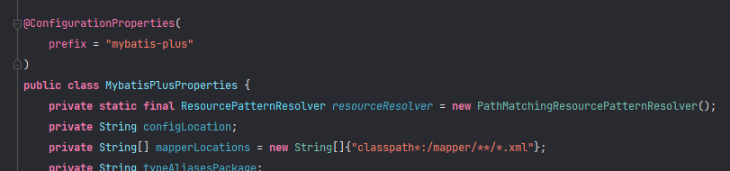

- #mybatis-plus #springboot
- id:: 622701dd-4aab-4591-bbd3-1e6a336ec6f8
	- [Mybatis-plus操作文档](https://baomidou.com/pages/24112f/)
	- ### 引入依赖
	- ```
	  <dependency>
	      <groupId>com.baomidou</groupId>
	      <artifactId>mybatis-plus-boot-starter</artifactId>
	      <version>3.5.1</version>
	  </dependency>
	  ```
	- ### 自动配置
		- mybatisPlusAutoConfiguration配置类.MybatisPlusProperties 配置项绑定.mybatis-plus：xxx 就是对mybatis-plus的定制
		- 
		- SqlSessionFactory自动配置好, 底层是容器中默认的数据源
		- mapperLocations自动配置好. 默认值: classpath*:/mapper/**/*.xml；任意包的类路径下的所有
		- 容器中也自动配置好了 SqlSessionTemplate
		- @Mapper 标注的接口也会被自动扫描；建议直接 @MapperScan("com.atguigu.admin.mapper") 批量扫描就行
		- ```java
		  @SpringBootApplication
		  @MapperScan("com.baomidou.mybatisplus.samples.quickstart.mapper")
		  public class Application {
		  
		      public static void main(String[] args) {
		          SpringApplication.run(Application.class, args);
		      }
		  
		  }
		  ```
	- ### 开始使用
		- 实体类
		- ```java
		  @Data
		  public class User {
		      private Long id;
		      private String name;
		      private Integer age;
		      private String email;
		  }
		  ```
		- mapper类
		  ```java
		  @Mapper
		  public interface UserMapperT extends BaseMapper<User> {
		  }
		  ```
		- service类
		- ```java
		  @Service
		  public class UserMappserTService {
		      @Autowired
		      UserMapperT userMapperT;
		  
		      public Long getCount(){
		          Long aLong = userMapperT.selectCount(null);
		          return aLong;
		      }
		  }
		  ```
	-
	- ### CURD整合
		- service类简化
		- ```java
		  @Service
		  public class UserServiceImpl extends ServiceImpl<UserMapper,User> implements UserService {
		  
		  }
		  
		  ```
		- Controller
		- ```java
		  @RestController
		  public class UserController {
		      @Autowired
		      UserMapper3Service userMapper3Service;
		  
		      @GetMapping("/countuser")
		      public String getUser(){
		          long count = userMapper3Service.count();
		          return String.valueOf(count);
		      }
		  }
		  ```
	-
	-
	- ### 分页
		- controller
		  ```java
		      @GetMapping("/pageuser")
		      public String pageuser(@RequestParam(value = "pn", defaultValue = "1") Integer pn) {
		          Page<User> objectPage = new Page(pn, 2);
		          Page<User> users = userMapper3Service.page(objectPage, null);
		          List<User> records = users.getRecords();
		           return records.toString()+":总共"+users.getPages()+",第"+users.getCurrent()+"页,共："+users.getTotal()+"条";
		      }
		  ```
		- 增加配置拦截器
		- ```java
		  @Configuration
		  public class MyBatisConfig {
		  
		      /**
		       * 新的分页插件,一缓和二缓遵循mybatis的规则,需要设置 MybatisConfiguration#useDeprecatedExecutor = false 避免缓存出现问题(该属性会在旧插件移除后一同移除)
		       */
		      @Bean
		      public MybatisPlusInterceptor mybatisPlusInterceptor() {
		          MybatisPlusInterceptor interceptor = new MybatisPlusInterceptor();
		          PaginationInnerInterceptor paginationInnerInterceptor = new PaginationInnerInterceptor();
		          // 溢出总页数后是否进行处理（请求页数大于最大页，是否跳回首页）
		          paginationInnerInterceptor.setOverflow(true);
		          // 单页分页条数限制(默认无限制,
		          paginationInnerInterceptor.setMaxLimit(10L);
		  
		          interceptor.addInnerInterceptor(paginationInnerInterceptor);
		          return interceptor;
		      }
		  }
		  ```
	-
	- ### 注解
		- @TableField
		- 字段注解（非主键）
		- [注解参数说明](https://baomidou.com/pages/223848/#tablefield)
		- ```java
		  public class User {
		      @TableId
		      private Long id;
		      @TableField("nickname")
		      private String name;
		      private Integer age;
		      private String email;
		  }
		  ```
		- | 属性 | 类型| 默认值 | 描述|
		  | --| --| --|--|
		  |value | String | "" | 数据库对应字段名,这里设置以这里为准|
		  |exist | boolean | true | 是否为数据库表字段|
		- @TableName
		- 描述：表名注解，标识实体类对应的表
		- 使用位置：实体类
		- ```java
		  @TableName("sys_user")
		  public class User {
		      private Long id;
		      private String name;
		      private Integer age;
		      private String email;
		  }
		  ```
		- | 属性|类型|默认值|描述|
		  | --|--|--|--|
		  |value | Stirng | "" | 表名|
	-