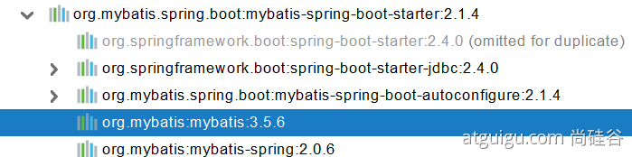

- #mybatis #springboot #mybatis-plus
- [Mybatis github地址](https://github.com/mybatis)
- [mybatis中文文档](https://mybatis.org/mybatis-3/zh/index.html)
- ### 引入第三方starter
	- ```
	  <dependency>
	      <groupId>org.mybatis.spring.boot</groupId>
	      <artifactId>mybatis-spring-boot-starter</artifactId>
	      <version>2.1.4</version>
	  </dependency>
	  ```
	- 
- ### 配置模式
	- 全局配置文件
	- sqlsessionFactory 自动配置好了
	- SqlSession: 自动配置了SqlSessionFactory组合了sqlsession
	- @import(AutoConfiguredMapperScannerRegistrar.class)
	- Mapper： 只要我们写的操作MyBatis的接口标准了 @Mapper 就会被自动扫描进来
-
	- application.yml配置
	- ```
	  # 配置mybatis规则
	  mybatis:
	    config-location: classpath:mybatis/mybatis-config.xml  #全局配置文件位置
	    mapper-locations: classpath:mybatis/mapper/*.xml  #sql映射文件位置
	  ```
	- mybatis-config.xml
	- ```
	  <?xml version="1.0" encoding="UTF-8" ?>
	  <!DOCTYPE configuration
	          PUBLIC "-//mybatis.org//DTD Config 3.0//EN"
	          "http://mybatis.org/dtd/mybatis-3-config.dtd">
	  <configuration>
	  </configuration>
	  ```
	- mapper接口xml
	- ```
	  <?xml version="1.0" encoding="UTF-8" ?>
	  <!DOCTYPE mapper
	          PUBLIC "-//mybatis.org//DTD Mapper 3.0//EN"
	          "http://mybatis.org/dtd/mybatis-3-mapper.dtd">
	  <mapper namespace="com.example.springboot3.mapper.UserMapper">
	      <select id="getUser" resultType="com.example.springboot3.bean.User" >
	          select * from user where id = #{id}
	      </select>
	      <!--useGeneratedKeys 开启使用自增的主键, keyProperty:主键id,  会将新增的记录的id放入insert的user对象中-->
	      <insert id="insertUser" useGeneratedKeys="true" keyProperty="id" >
	          insert into user (`name`,`get_other`) values(#{name},#{getOther})
	      </insert>
	  </mapper>
	  ```
	- 全局参数设置
	- ```
	  # 配置mybatis规则
	  mybatis:
	  #  config-location: classpath:mybatis/mybatis-config.xml
	    mapper-locations: classpath:mybatis/mapper/*.xml
	    configuration:
	      map-underscore-to-camel-case: true
	      
	      
	   可以不写全局；配置文件，所有全局配置文件的配置都放在configuration配置项中即可
	  ```
	- 流程:
		- 1. 导入mybatis官方starter
		  2. 编写mapper接口,标准@mapper接口
		  3. 编写sql映射文件并绑定mapper接口
		  4. 在application.yml中指定mapper配置文件的位置,以及指定全局配置文件的信息
- ### 注解模式
	- ```
	  @Mapper
	  public interface CityMapper {
	  
	      @Select("select * from city where id=#{id}")
	      public City getById(Long id);
	  	@Insert("insert into user (`name`,`get_other`) values(#{name},#{getOther})")
	      @Options(userGeneratedKeys=true,keyProperty="id")
	      public void insert(City city);
	  
	  }
	  ```
- ### 混合模式
	- ```
	  @Mapper
	  public interface CityMapper {
	  
	      @Select("select * from city where id=#{id}")
	      public City getById(Long id);
	  
	      public void insert(City city);
	  
	  }
	  ```
	- mapper.xml
	  ```
	  <?xml version="1.0" encoding="UTF-8" ?>
	  <!DOCTYPE mapper
	          PUBLIC "-//mybatis.org//DTD Mapper 3.0//EN"
	          "http://mybatis.org/dtd/mybatis-3-mapper.dtd">
	  <mapper namespace="com.example.springboot3.mapper.UserMapper">
	      <!--useGeneratedKeys 开启使用自增的主键, keyProperty:主键id,  会将新增的记录的id放入insert的user对象中-->
	      <insert id="insertUser" useGeneratedKeys="true" keyProperty="id" >
	          insert into user (`name`,`get_other`) values(#{name},#{getOther})
	      </insert>
	  </mapper>
	  ```
	- 流程:
		- 1. 引入mybatis-starter
		  2. 配置application.yml中, 指定mapper-location位置
		  3. 编写mapper接口并标注@Mapper注解
		  4. 或者使用@MaperScan("com.x.x.x.x")简化扫描, 其他接口就不用标注@Mapper接口
- ## Mybatis-plus
- {{embed ((622701dd-4aab-4591-bbd3-1e6a336ec6f8))}}