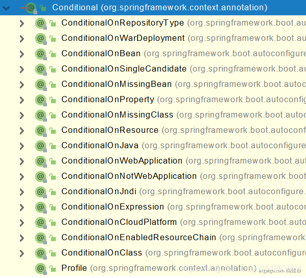

- #注解 #springboot
- {{renderer :toc_hvepclg}}
	- ## springboot注解
		- ### **@SpringBootApplication**
		- springboot启动注解
			- 包含: @SpringBootConfiguration @EnableAutoConfiguration @ComponentScan("com.lun")
		- ### **@RestController**
		  包含 @Controller @ResquestBody
		-
		- ### **@RequestMapping**
		-
		- ### **@Configuration**
		  id:: 621f8d9e-8ddd-4a8c-9ebe-fe4600e6b402
			- 告诉springboot这是一个配置类; 相当于 application.xml(spring配置xml文件)
			- proxyBeanMethods: 代理bean的方法
				- Full模式(proxyBeanMethods=true) 保证每个@Bean方法被调用多少次返回的都是一个实例
				- Lite模式(proxyBeanMethods=false)每个@Bean方法被调用多少次返回的组件都是新建的
		- ```java
		  @Configuration(proxyBeanMethods = false)
		  public class MyConfig{
		    
		    @Bean("name")
		    public Tom gettom(){
		      return new Tom();
		    }
		    @Bean
		    public Cat getcat(){
		      return new Cat();
		    }
		  }
		  ```
		- ### **@Bean**
		  id:: 6220bdab-6d5b-4edd-af03-f15de7c3dd2b
			- 给ioc容器中添加组件,以方法名作为组件id, 返回类型就是组件类型,返回值作为容器中id对应的实例
			- 如果其中传入值,就是组件容器注册的id;
			- ``` java
			  @Configuration
			  public class MyConfig{
			    
			    @Bean("name")
			    public Tom gettom(){
			      return new Tom();
			    }
			    @Bean
			    public Cat getcat(){
			      return new Cat();
			    }
			  }
			  
			  ```
		- ### **@Import**
		  id:: 6220c08c-b903-46f4-8006-417494750d79
			- @Bean、@Component、@Controller、@Service、@Repository 是spring基本标签,基本功能未改变
			- @Import 给容器自动创建两个类型的组件, 默认名称就是全类名(com.x.x.x)
			  ```java
			  @Import({DBHelper.class})
			  @Configuration
			  public class MyConfig(){
			    
			  }
			  
			  // 获取组件
			  ConfigurableApplicationContext run = SpringApplication.run(MainApplication.class, args);
			  // 获取user类型的所有组件名称
			  run.getBeanNamesForType(User.class);
			  // 获取DBHelper 对象
			  run.getBean(DBhelper.class); 
			  ```
		- ### **@Conditional**
		  id:: 6220c08d-9456-4d99-9788-1769804efa25
			- ◼ 条件装配(满足Conditional指定的条件,进行组件注入)
			- ◼ 修饰方式:
				- 修饰类:  满足条件才能加载修饰类中所有配置
				- 修饰方法: 满足条件才能加载修饰方法所属配置
			- ◼ 其他扩展注解
			  
			- ◼ **@ConditionalOnMissingBean案例**
			  ```
			  @Configuration
			  @ConditionalMissingBean(name="test")
			  public class MyConfig{
			  	
			      @Bean
			      public User getuser(){
			      	return new User();
			      }
			  }
			  ```
				-
		- ### **@ImportResource**
		  id:: 6220c773-1548-473b-8dd3-debd84dbb95d
			- 加载xml文件
			  ```
			  @ImportResource("classpath:beans.xml")
			  public class MyConfig{
			  	
			  }
			  ```
		- ### **@ConfigurationProperties**
		  id:: 6220c7bc-767c-480a-958b-0f17f920576c
			- 使用java读取到properties文件中内容,并封装到javabean中
			- 传统方法
			  ```
			  public static void main(String [] args){
			  	Properties props = new Properties();
			      props.load(new FileInputStream("xx.properties"));
			      ....
			  }
			  ```
			- @ConfigurationProperties+@Component
				- ```properties
				  // application.properties
				  my.name=abc
				  ```
				- ```java
				  @Component
				  @ConfigurationProperties(prefix = "my")
				  public class Ca{
				    
				    private String name;
				    
				  }
				  ```
			- @ConfigurationProperties+@EnableConfiruationProperties
				- 1. 开启配置绑定
				  2. 将这个 properties所属对象 自动注入到容器中
				- ```java
				  @EnableConfigurationProperties(Ca.class)
				  public class Myconfig{
				  
				  }
				  ```
				- ```java
				  @ConfigurationProperties(prefix = "my")
				  public class Ca{
				    
				    private String name;
				    
				  }
				  ```
		- ### 常见参数注解
		  id:: 622171bd-6ec8-4a3f-abc7-fe8cf9798a5b
			- #### **@PathVeriable**
			  id:: 62218651-cf82-4e40-a92e-3faf9391f20e
				- 路径变量
				- ```java
				  @GetMapping(/get/{id})
				  public String get(@PathVariable("id") int id
				  				 ,@PathVariable Map<String,String> pv){
				  	return id+"";
				  }
				  ```
				- 如果@PathVariable修饰的是一个map会将所有的放到这个map里
			- #### **@RequestHeader**
				- 获取请求头
				- ```java
				  @GetMapping(/get/{id})
				  public String get(@RequestHeader("User-Agent") String heaser1
				  				 ,@RequestHeader Map<String,String> pv){
				  	return heaser1+"";
				  }
				  return heaser1+"";
				  }
				  ```
				- @RequestHeader可以修饰一个map,MultiValeMap;HttpHeaders
			- #### **@RequestParam**
				- 获取请求参数: url?a=1&n=2
				- ```
				  @RequestParam("age") int a
				  @RequestParam Map<String,String> maps
				  @RequestParam
				  ```
			- #### **@CookieValue**
				- 获取cookie值
				- ```
				  @CookieValue("_ga") String ga
				  @CookieValue("_ga") Cookie cookie
				  ```
			- #### **@RequestBody**
				- 获取请求体[POST]
				- ```java
				  @POSTMapping("/save")
				  public void save(@RequestBody String content){
				    
				  }
				  ```
			- #### **@RequestAttribute**
				- 获取request域属性
				- ```java
				  @GetMapping("/goto")
				  public String goToPage(HttpServletRequest request){
				      request.setAttribute("msg","成功了...");
				      request.setAttribute("code",200);
				      return "forward:/success";  //转发到  /success请求
				  }
				  @GetMapping("/success")
				  public String success(@RequestAttribute("msg") String msg,
				                       HttpServletRequest request){
				    request.getAttribute("msg");
				  }
				  
				  ```
			- #### **@RequestPart**
			  id:: 6221a9cb-4904-48e9-9a22-9c34cab70b60
				- 文件上传使用注解
				- ```javascript
				  let formData = new FormData();
				  formData.append("fileName", "文件名");
				  formData.append('stream',  this.file);
				  // formData.append("fileTemplateConfs", new Blob([JSON.stringify({"title": "测试标题", "type": 3})], {type: "application/json"}));
				  console.log(JSON.stringify(fileData.fileTemplateConfs))
				  formData.append("fileTemplateConfs",  new Blob([JSON.stringify(fileData.fileTemplateConfs)], {type: "application/json"}));
				  axios.post(`http://0.0.0.0:8082/test`, formData, {headers: {'Content-Type': 'multipart/form-data'}})
				    .then(response => {
				  
				    }).catch(() => {
				  });
				  ```
				- ```java
				  @PostMapping(value = "/test")
				  public Result test(@RequestPart("fileName") String fileName,
				                     @RequestPart("stream") MultipartFile stream,
				                     @RequestPart List<FileTemplateConf> fileTemplateConfs
				  				 )throws Exception{
				                   
				      stream.transferTo(new File("d:/img/"+stream.getOriginalFilename()));
				  	System.out.println(fileName);
				  	System.out.println(fileTemplateConfs);
				  	System.out.println(stream.getOriginalFilename());
				  	return Result.success(null,"");
				  }
				  ```